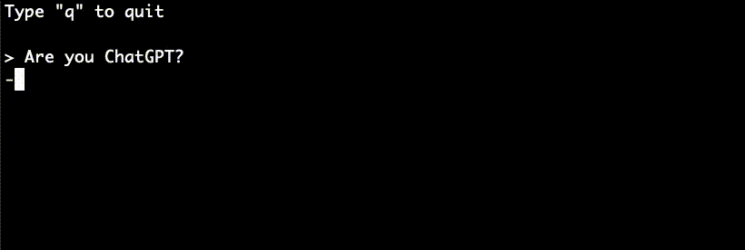

# HuggingChat client

[](https://opensource.org/licenses/MIT)
[](https://packagist.org/packages/maximerenou/hugging-chat)
[](https://packagist.org/packages/maximerenou/hugging-chat)
[](https://packagist.org/packages/maximerenou/hugging-chat)

This is an unofficial PHP client for **HuggingChat** (OpenAssistant's LLaMA model).

## Installation

    composer require maximerenou/hugging-chat

## Demo

Run `examples/chat.php` to test it.



## Usage

```php
use MaximeRenou\HuggingChat\Client as HuggingChat;
use MaximeRenou\HuggingChat\Prompt;

$ai = new HuggingChat();

$conversation = $ai->createConversation();

// $answer - full answer
$answer = $conversation->ask(new Prompt("Hello World"));
```

<details>
  <summary>Real-time / progressive answer</summary>

You may pass a function as second argument to get real-time progression:

```php
// $current_answer - incomplete answer
// $tokens - last tokens received
$final_answer = $conversation->ask($prompt, function ($current_answer, $tokens) {
    echo $tokens;
});
```

</details> 

<details>
  <summary>Resume a conversation</summary>  

If you want to resume a previous conversation, you can retrieve its identifiers:

```php
// Get current identifiers
$identifiers = $conversation->getIdentifiers();

// ...
// Resume conversation with $identifiers parameter
$conversation = $ai->resumeChatConversation($identifiers);
```

</details> 

<details>
  <summary>Generate a conversation's summary</summary>

Useful to give a title to a conversation.

```php
// Question asked: "Who's Einstein?"
// ...
$summary = $conversation->getSummary();
// Result: Famous genius mathematician.
```

</details> 

<details>
  <summary>Handle HuggingChat errors</summary>

The code throws exceptions when it receives an error from HuggingChat. You can therefore use a try/catch block to handle errors.

</details>

<details>
  <summary>Answers are sometimes malformed (or dumb)</summary>

That's what OpenAssistant's LLaMA model used by HuggingChat generates...

</details>

---------------------------------------

#### Disclaimer

Using HuggingChat outside huggingface.co/chat may violate HuggingFace terms. Use it at your own risk.
